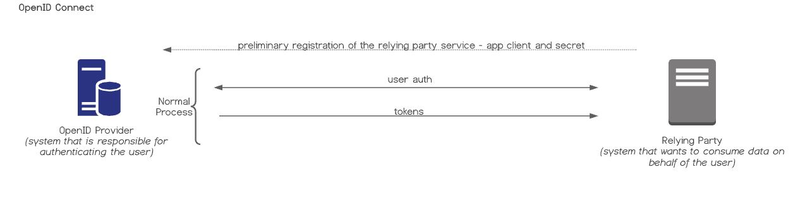
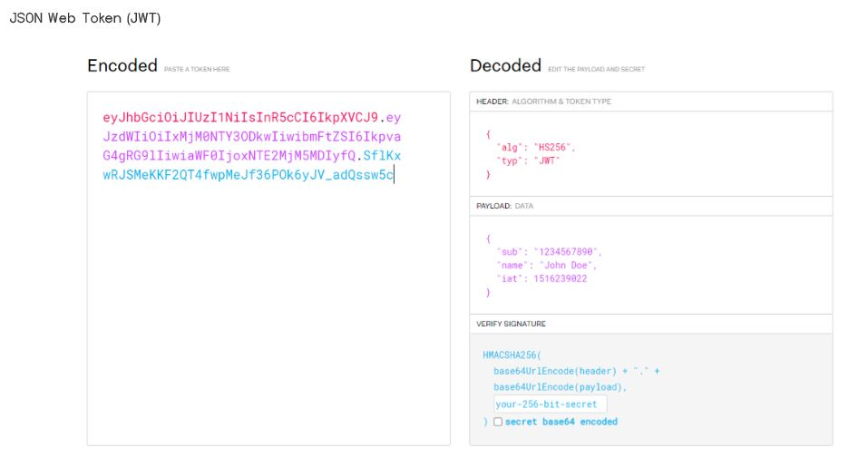

## Cognito

### Overview
Allows developers to focus on key features of their applications and not worry about standing up custom auth.

### OAuth 2.0 and OIDC
OAuth 2.0 is an open standard that gives users a way to authorize a service to access other services without giving it explicit credentials. Instead access tokens are used. 

OIDC is a specification that sits on top of OAuth2 and brings in the specification for identity.

### JSON Web Token (JWT)
A JWT is a base64 encoded string that represents key value pairs. The sections of the JWT are separated by periods. The sections are the **header**, **payload** and **signature**. The header holds the encryption method used. The payload holds user data and the signature validates the token.

### Cognito User Pools
Key features:
    * Managed user directory that scales to 100s millions of users
    * Customizable sign up and sign in
    * OAuth 2.0 Support
    * Federation with Facebook, Amazon, Google and custom OIDC/SAML providers
    * User passwords are not stored, but instead SRP verifier is stored

### Cognito Identity Pool
Used to map a Cognito User Pool token to AWS STS credentials