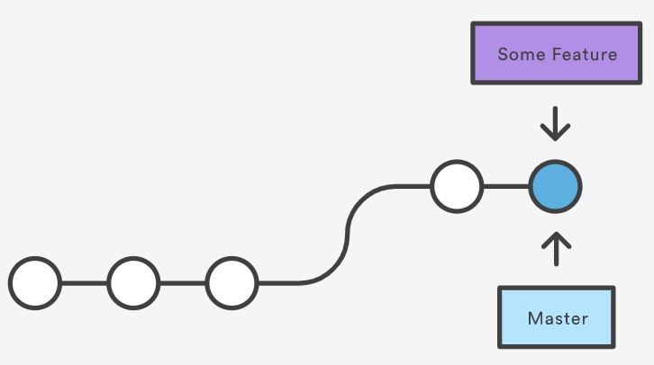

*Disclaimer: This info. was sourced and summarized from [here](https://www.atlassian.com/git/tutorials/using-branches/git-merge).*

# Git Merge

`git merge` takes two branches worth of commits and merges them into a single branch. The merge always takes place on the current branch and merges in the target branch, which remains unaffected by the merge.

For example, assume below that we are on master and run `git merge <feature-branch-name>`. This will take branch `<feature-branch-name>` and merge its commit history with master and create a new merge commit at the end.

## Conflicts

Conflicts occur when the same data is changed in both branch histories. This occurs because git cannot determine which history it should take. This has to be resolved by the user.

Conflicts are presented using the `<<<<<<<` and `=======` syntax. Content before `========` is the current branch, while content after is the branch merging in.

After resolving the conflicts, the conflicted file must be `git add` and a merge commit must be generated with `git commit`.

## Fast Forward Merge

The fast forward merge is used when the target branch is just an extension of the source branch. For example, if we branch off of master to a feature and then attempt to merge the feature back in and master has not changed since our branching occurred, a fast forward merge would just move the master tip to the tip of the feature branch.

Before Fast Forward Merge

After Fast Forward Merge

## Three Way Merge

The three way merge occurs when a fast forward merge is not possible because the current branch has diverged since the initial branching. This type of merge is depicted in the [first section](#git-merge) of this doc.