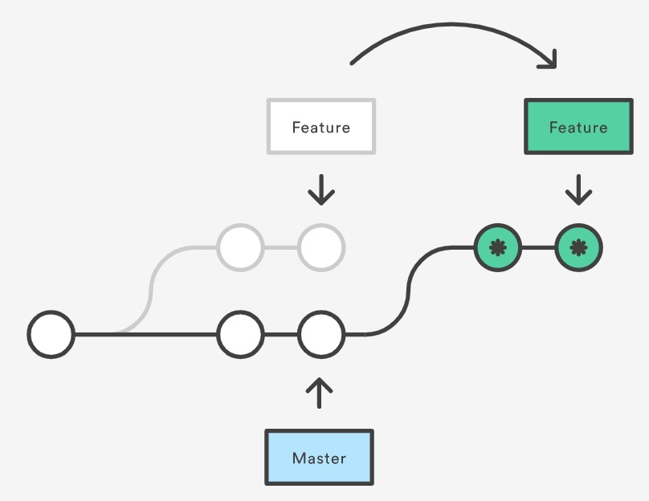

*Disclaimer: This info. was sourced and summarized from [here](https://www.atlassian.com/git/tutorials/rewriting-history/git-rebase).*

# Git Rebase

Rebase your current branch onto `<base>` (which can be an ID, branch name, tag...)
`git rebase <base>` 

Rebasing is the process of rewriting a branch's commits to a base commit. Essentially, it reshapes things to how they would be if you created the feature branch from a different base commit.

## So why would you want to rebase?

By rebasing you maintain a linear history. For example, if you are on a feature branch for a while and master is moving ahead without you, you can rebase to master to work in the changes from master and give the appearance that you initally branched from the current master. **All of this then avoids an unnecessary and cluttering merge commit due to a [three way merge](../merge/merge#three-way-merge).**