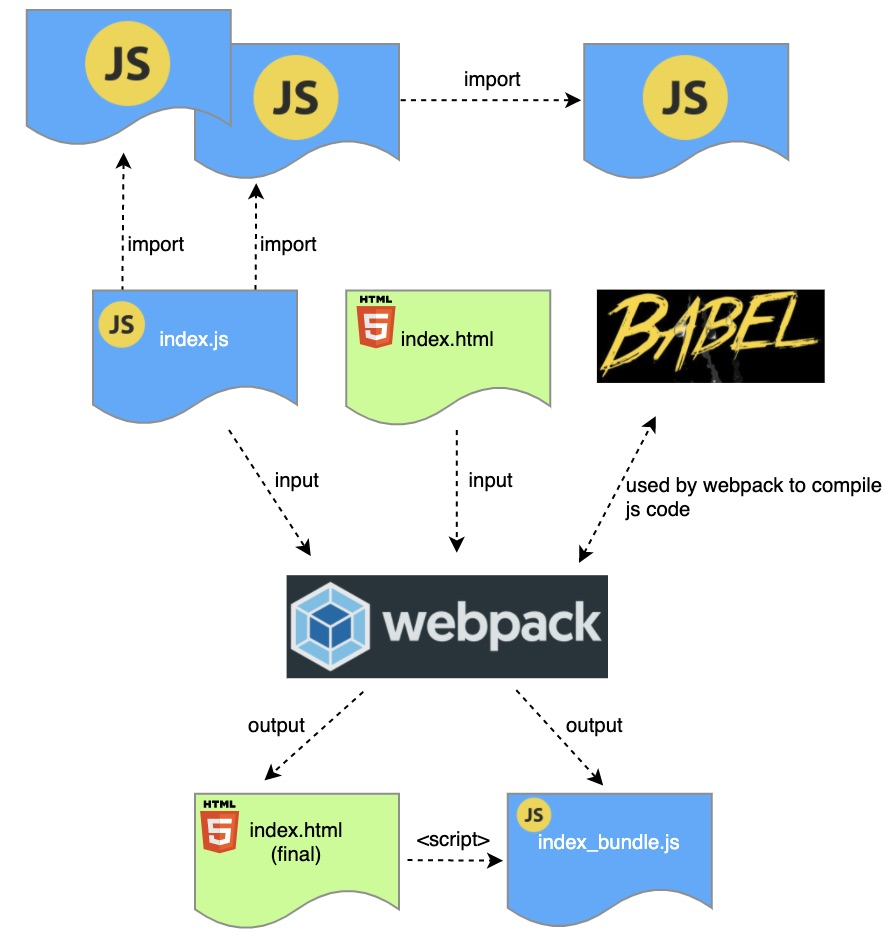

# React Deep Dive

## What is React?
At a high level, React is a JavaScript library that assists developers with building user interfaces. Developers use React to build components that are then compilied into elements on an HTML page.

## Why React?
From my own research there are a few main points that give React its popularity: 

1. **Component based development yields multiple benefits**. By developing in a component based environment you can achieve efficient **code reuse**. Instead of having duplicate code scattered across multiple applications you can manage a single contained component that can be reused all over and enforces a single point of control over change methodology. Secondly, the components and their state allow for a shift away from explicitly changing DOM nodes via JS or jQuery and instead declaring state attributes that then control the view. 

2. **React is consistently quick**. What I mean by this is its use of the **virtual DOM** allows efficient diffing and reconciliation to determine the minimum number of changes for the actual DOM. What initially tripped me up was that I thought that this speed could not be achieved by using raw JavaScript or jQuery. However, the benefit more comes from React's consistenty to avoid speed pitfalls or full rerenders that you could accidentally do when performing your own raw development.

3. **React is maintained by Facebook, which should result in years of solid maintenance and development**.

## Setting Up A Sample Project (Without `create-react-app`)
An easy way to initialize a new React project is with `create-react-app`, however, if you are new to React like me then you may want to initialize the project and its dependencies manually so it is not a black box. The fourth and fifth [sources](#sources) were extremely helpful to me while learning this process. 

### Create New Project
1. Initialize new npm project
    ```sh
    mkdir <my-project-dir>
    cd <my-project-dir>
    # initialize npm project with default package.json
    npm init -y 
    ```
2. Initialize git
    
    `git init`

3. Add `.gitignore`
    ```sh
    # pushing and pulling all packages would be time consuming and overwhelming
    node_modules/
    # don't want to push builds
    dist/
    # if mac
    .DS_Store
    ```

3. Finish directory structure
    ```sh
    # cwd = <my-project-dir>
    mkdir app
    cd app
    # base source page
    touch index.js
    ```
    
4. Add template `index.html` page to `app/`

    This page is the base page used by webpack and `html-webpack-plugin` to construct the final `dist/index.html` page.

    ```html
    <!DOCTYPE html>
    <html>
      <head>
        <title>React Demo</title>
      </head>
      <body>
        <div id='app'></div>
      </body>
    </html>
    ```

### Install Dependencies
There are three main assets, listed below, that need to be configured properly to start your journey with React.

1. **`react` and `react-dom`** - `react` is the main package for React, while `react-dom` allows for React specific DOM interaction. They are managed as two separate packages so that `react` can be used for other user interfaces outside of the browser.

    **installation**
    
    `npm install react react-dom`

2. **Babel** - Babel is a transpiler, which takes current JS syntax and transforms it to be compatible with older browsers. More specifically to React, Babel is responsible for compiling JSX to browser compatible code. Part of the webpack process (described later) is calling Babel to perform the transformations.

    **installation**

    `npm install @babel/core @babel/preset-env @babel/preset-react babel-loader --save-dev`
    - `@babel/core` is the main package
    - `@babel/preset-env` is needed by Babel for compiling modern JS
    - `@babel/preset-react` is needed by Babel for compiling React and more specifically, JSX
    - `babel-loader` is needed by webpack to interface with Babel

    **configuration**

    Create a new file named `.babelrc` at the project root. This file specifies the Babel configuration (what Babel should use when given some module). In our case for React we want our modern JS syntax to be compiled (`@babel/preset-env`) and our React syntax to be compiled (`@babel/preset-react`).
    ```javascript
    {
        "presets": ["@babel/preset-env", "@babel/preset-react"]
    }
    ```

3. **`webpack`** - In a general sense, webpack is a code/module bundler that ingests, transforms and bundles target code and outputs it as a minified resource. Specifically to React, it ingests modules and outputs bundled JS code that the majority of browsers can interpret. After webpack is done with its work there is a single JS file with all of your code, ready to be included via a `<script>` tag in HTML. Webpack works off of a file named `webpack.config.js`, which specifies settings for building this output. For a detailed explanation of setting up webpack please reference the sixth article of [sources](#sources).

    **installation**

    Install the base packages

    `npm install webpack webpack-cli --save-dev`

    **Note: This installation may produce warnings with fsevents and chokidar dependencies. This should be fixed in webpack version 5, which is in beta as of now (Aug. 2020).**

    We also need one more package, `html-webpack-plugin`, for webpack and React to work the way we want. The purpose of this dependency initially tripped me up, but it is actually really useful. This plugin is used by webpack to generate a final HTML page in your `dist` folder. It takes in a template HTML page that it copies to create the new target page, but it automatically includes a `<script>` tag that references your bundled JS code.

    To install

    `npm install html-webpack-plugin --save-dev`

    **configuration**
    1. Add the following webpack configuration to `webpack.config.js` in the root directory.
        ```javascript
        const path = require('path');
        const HtmlWebpackPlugin = require('html-webpack-plugin');
        module.exports = {
            // where the main module is
            entry: './app/index.js',
            // where to output bundled code (will automatically create dist folder)
            output: {
                path: path.resolve(__dirname, 'dist'),
                filename: 'index_bundle.js'
            },
            module: {
                rules: [
                    // any JS module, run it through babel-loader (which will use our presets)
                    { test: /\.(js)$/, use: 'babel-loader' }
                ]
            },
            // 'development' or 'production'
            mode: 'development',
            // allows for html-webpack-plugin to produce output HTML page
            plugins: [
                new HtmlWebpackPlugin({
                    template: 'app/index.html'
                })
            ]
        };
        ```
    
    2. Add the following to `package.json` (by doing so `npm run build` will build our artifacts)
        ```javascript
        "scripts": {
            // compile JS code
            "build": "webpack"
        }
        ```

### `webpack` Dev Server
When developing you don't want to have to build your code all the time to the `dist` directory. By using the webpack development server you can avoid this because it continuously builds an updated bundle to its cache, which is efficient. The server uses hot reloading so you only have to start it up once.

**installation**

`npm install webpack-dev-server --save-dev`

**configuration**

Add the following to `package.json` (by doin so `npm run start` will start development server)
```javascript
"scripts": {
    // start dev server
    "start": "webpack-dev-server --open"
}
```

### Build Process


## Sources
**Disclaimer: info. for this page has been sourced from the following:**

1. [React Tutorial](https://www.youtube.com/watch?v=DLX62G4lc44)
2. [React Speed Justification (Or Not?)](https://stackoverflow.com/questions/33355125/what-really-makes-reactjs-as-fast-as-it-claims-to-be)
3. [JSX](https://reactjs.org/docs/introducing-jsx.html)
4. [Set Up React Project From Scratch](https://www.valentinog.com/blog/babel/)
5. [Set Up React Project From Scratch Video (Preferred)](https://www.youtube.com/watch?v=Zb2mQyQRwqc)
6. [What Is webpack?](https://dev.to/vish448/webpack-for-react-intro-3n01)
