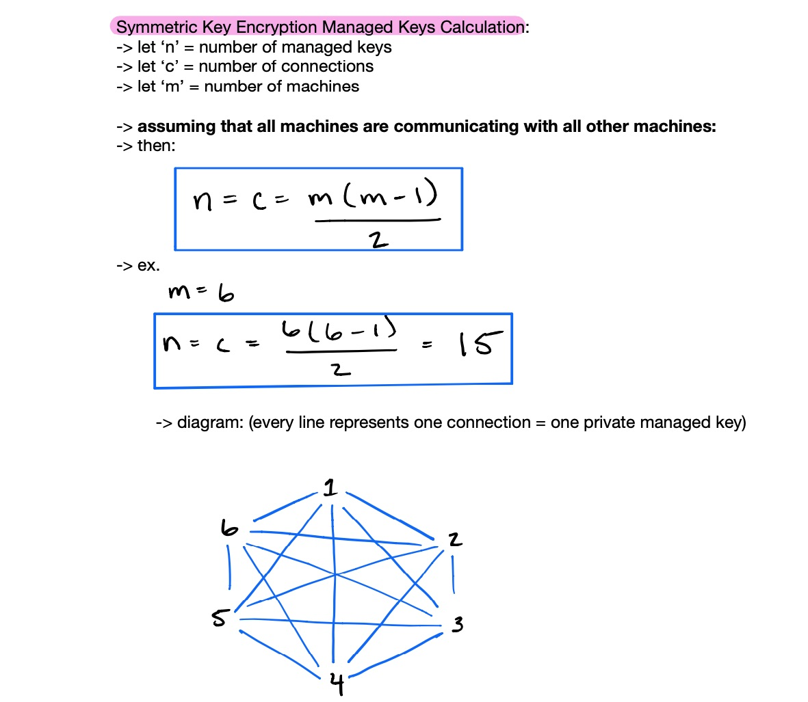
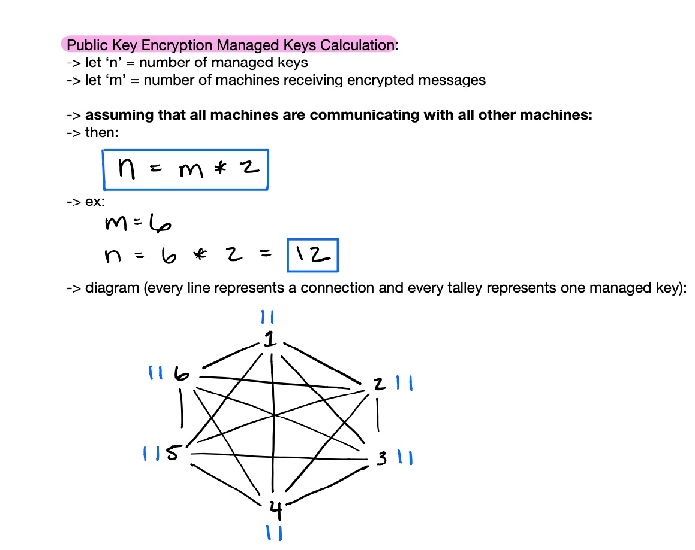
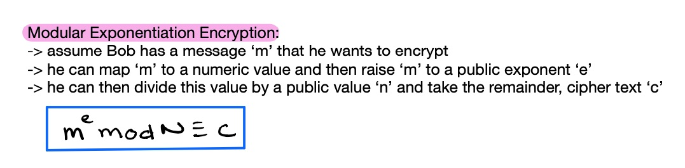
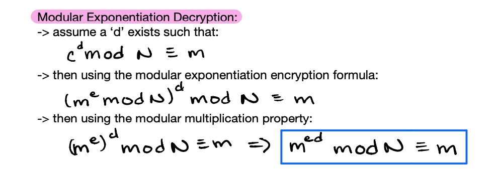
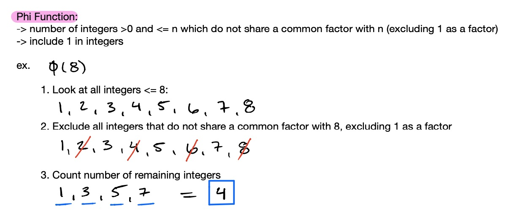
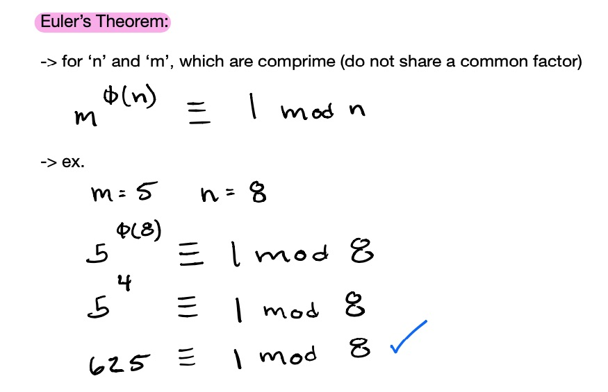
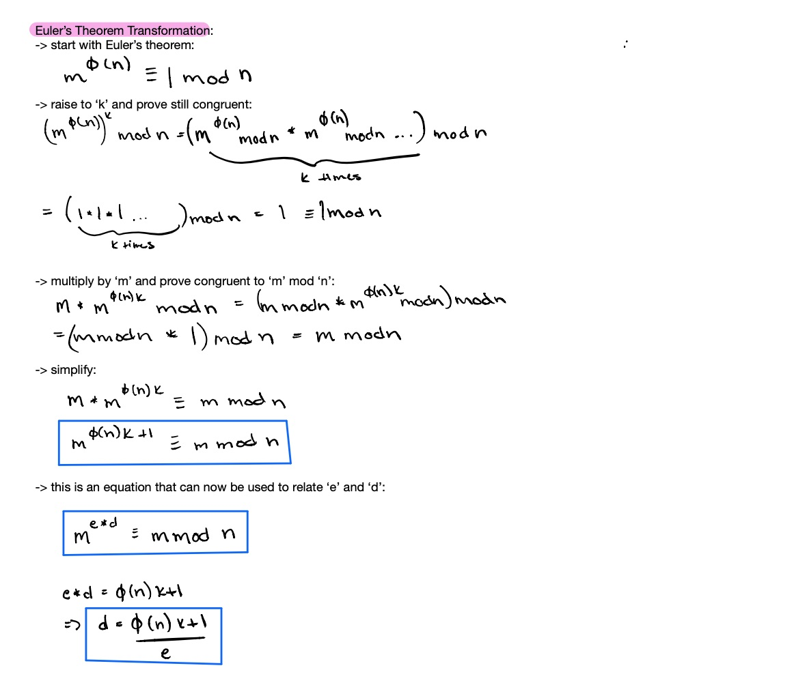
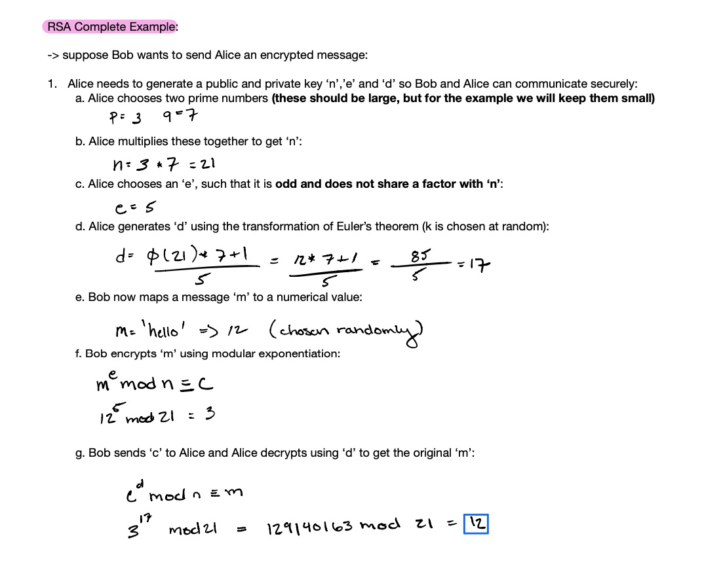

### RSA Encryption (Rivest–Shamir–Adleman)

#### Background

There was a need to fill that symmetric key encryption could not. The issue with symmetric key encryption is that if multiple people want to talk to you, you need to manage many individual private keys, one per connection, as pictured below:

#### James Ellis
This type of key management (rotation and distribution) can become overwhelming for a machine with many connections. James Ellis, a British engineer in the 1970s, was inspired by this problem and proposed a theory of public key encryption (later to become RSA) to solve this issue. His solution was based on the encryption of communication during WWII, which involved adding and removing noise to distort and recover messages (add noise to a message to distort it during transit and then remove noise upon receiving the cipher to uncover the original message). Ellis created an ananlogy between this type of encryption and a physical lock and key pair. Imagine that a computer possesses its own lock and key pair, similar to the one you use to lock your locker at the gym with. If another computer wants to talk to this computer, then the receiver (lock owner) can share the **open** lock with the sender (this could represent the noise to add in the WWII scenario). The sender can then enclose the message in a box and lock it with the given lock (add noise). The receiving computer can then use the private key (which can be viewed as the inverse to this lock) of the lock to unlock the message (remove noise and uncover original message). **Theoretically, if the computer could share this one lock simultaneously to many senders then the receiving computer would only have to worry about managing the single lock and key pair.**

#### Key management calculations
This theory was encouraging because if we take a look at key management between public key encryption and symmetric key encryption, there are benefits that begin to be realized as the number of connections grow. For example, imagine 3 computers want to all simultaneously talk secretly to one another. With symmetric key encryption this would require a total number of 3 managed keys (one per connection). You might say, well public key encryption would require 6 total managed keys (one public and one private per receiving machine), and you would be right. However, as the number of machines grow in this scenario, the benefits of public key encryption are realized. For example, now imagine 6 machines in the same situation. With symmetric key encryption there would need to be a total of 15 managed keys (one per connection). With public key encryption there would need to only be 12 managed keys (one public and one private per receiving machine). This tradeoff occurs because symmetric key encryption key management is a function of the number of connections while public key encryption key management is a function of the number of **receiving machines** involved. The intersection point for this type of scenario (every machine talking to one another) would be 5 machines, which would result in 10 managed keys for both symmetric and public key encryption. 

The two images below show the respective functions for calculating the number of managed keys for both symmetric and public key encryption:

symmetric key encryption managed keys calculation:

public key encryption managed keys calculation:

#### Clifford Cocks (Modular Exponentiation)
This was all good in theory, but Ellis did not have a mathematical formula that could be used for encryption and decryption. At this point Ellis passed the torch to a British mathematician named Clifford Cocks. Cocks needed to derive a function that would be easy to calculate in one direction (encryption), but extremely difficult to reverse (decryption), except for the receiver of course. For this, he turned to a special type of one-way function called a "trapdoor one-way function". This is a function that is easy to calculate in one direction, but extremely difficult to reverse, unless you possess what is known as the "trapdoor". For this, Cocks used **modular exponentiation**, pictured below:

modular exponentiation encryption:

Therefore, if a sender mapped a message 'm' to a numerical value, then he or she could perform the above steps to calculate 'c', which would represent the cipher text. **The reason that this function is acceptable for encryption is because it is easy for the sender to calculate 'c' and extremely difficult to calculate 'm' from 'c', 'e' and 'n'. A hacker would have to resort to trial and error to reverse the function.** At this point, Cocks now had an equation that could represent a theoretical 'open lock' that could be applied to 'm' to 'lock' it up as 'c' ('e' and 'n' are viewed as a pair that create the public key). However, you may ask now, well if it is difficult to calculate the original message, 'm', from just 'e', 'n' and 'c', then how is the receiver supposed to decrypt the sender's message? This is where the trapdoor comes into play, our private key. Assume the following:

modular exponentiation decryption:

**Therefore, if Cocks could find a 'd' that made the above true, then this 'd' could be the trapdoor, or the private key. However, he needed to construct 'd' in such a way that it would extremely difficult to calculate just from the public key constructed of 'e' and 'n'. This calculation of 'd' requires a second one-way function (our first being the function to calculate the cipher text)**

#### Clifford Cocks (Euler)
Cocks had two properties to satisfy for 'd':
1. 'd' must satisfy the equation above (modular exponentiation decryption)
2. 'd' must be extremely difficult to calculate (except for the owner)

Cocks tackled the second point first. For this type of one-way function, Cocks looked to Euclid for help. Euclid proved long ago that every number has exactly one prime factorization. As it turns out,the prime factorization of a number is difficult to compute (in terms of time complexity) as the number grows larger and larger. Even for a computer, the prime factorization of extremely large numbers can take years. Cocks used this fact to his advantage. If he could incorporate prime factorization into calculating 'd', then it would be extemely difficult to ever actually calculate. However, he needed to work in a trapdoor so it would be easy for the owner of the private key to calculate 'd'. For this, Cocks looked to Euler for help. In the 1700s Euler developed the phi function, which states that phi(n) is equal to the number of integers that are less than or equal to n, which don't share a common factor with n (excluding 1). For example, see the image below:

phi function:

**You may ask, how does the phi function incorporate prime factorization? Well, there are two key properties of the phi function:**
1. if 'n' is prime, then phi(n) = n - 1
2. the phi function is a multiplicative: phi(ab) = phi(a)phi(b)
**Therefore, if you know the prime factorization of a value 'n', let's say p and q, then it is extremely easy to calculate phi(n) because it is just phi(p)phi(q) = (p-1)(q-1). However, if you do not know the prime factorization then phi would be extremely difficult to calculate for large numbers. The only easy way to calculate phi(n) is knowing the prime factorization, which itself is extremely difficult to calculate.**

Now let's say the owner of 'd' generates two extremely large prime numbers (they must be big so 'n' is large and the prime factorization is difficult to calculate), let's say 'p' and 'q'. He or she then multiplies them together to get 'n' and then hides 'p' and 'q' away. Now, he or she is the only one who can quickly calculate phi(n) because he or she is the only person who knows the prime factorization of 'n'. This is the trapdoor for phi(n) and the prime factorization of 'n'. Now Cocks still had to figure out how to relate phi(n) to calculating 'd', which needed to satisfy its second property of modular exponentiation decryption. For this magic relationship, Cocks turned to none other than Euler for "Euler's theorem":

Cock's realized that he could manipulate Euler's theorem as follows:

**This was the magic that brought everything together. Cocks now had the following:**
1. start with the following equation for encryption:
    - m^e mod n (congruence) c
2. it was proved above, that if a 'd' exists such that:
    - c^d mod n (congruence) m => then:
    - m^(e*d) (congruence) m mod n
3. by Euler's theorem:
    - m^(phi(n)k+1) (congruence) m mod n
4. which can be rewritten as:
    - m^(ed) (congruence) m mod n
5. which meant that Cocks now had the following function for 'd':
    - d = (phi(n)k + 1)/e
    - which is extremely difficult to solve because phi(n) is extremely difficult to solve unless you have the prime factorization of 'n' which is extremely difficult to solve if 'n' is large
**All of this brought together meant that someone could use modular exponentiation to encrypt a message 'm', but could not decrypt it easily without 'd', which is extremely difficult to calculate, except for the sender. This completed everything that Cocks needed for secure transfer**

This knowledge was classified after its discovery, but it was rediscovered by Rivest, Shamir and Adleman, to create RSA.

Pictured below is a walkthrough of RSA encryption in action:

